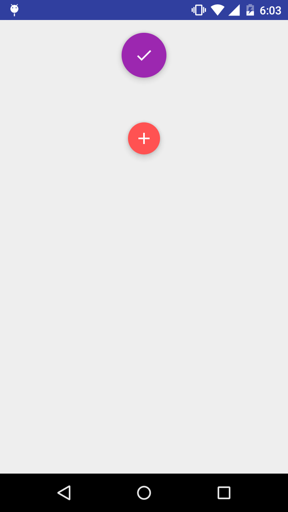
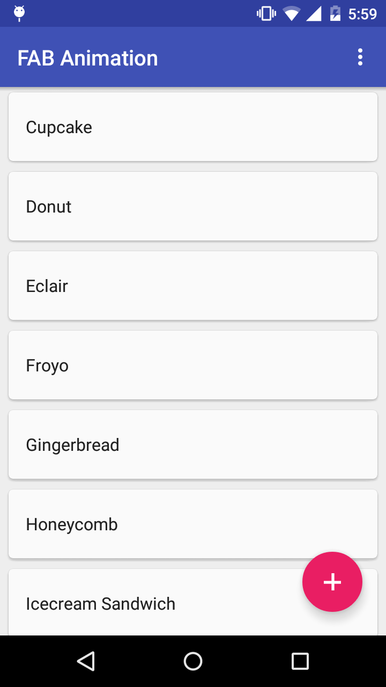
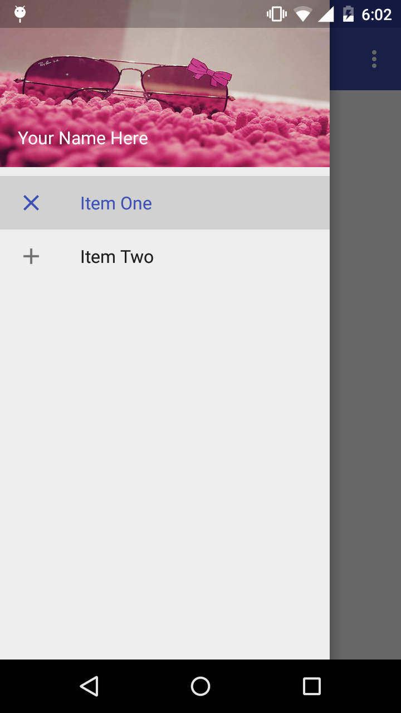

Android Material Sample
===================================

This sample shows new design material and
how to interact with them.

Introduction
------------

This sample shows how to implement a new material design.

Android Toolbar is hide respect to scroll from up to down.
Android collapse toolbar has expand respect to a scroll view.
special motion behaviors related to morphing, launching, and the transferring anchor point.

Floating action buttons come in two sizes:
the default, which should be used in most cases, and the mini,

Pre-requisites
--------------

- Android Build Tools v22.0.1
- Android Support Repository

Screenshots
-------------

   

Getting Started
---------------

This sample uses the Gradle build system. To build this project, use the
"gradlew build" command or use "Import Project" in Android Studio.

